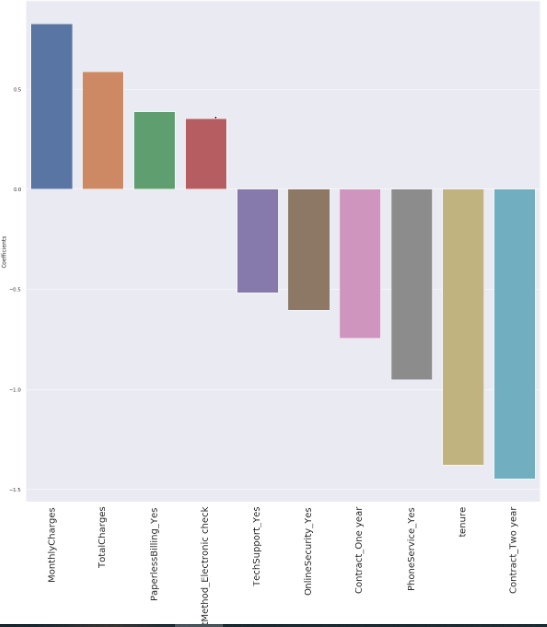
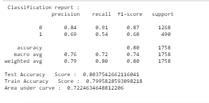

# Telecom-Customer-Churn

Visualization and Applying linear models on determining the churn, a hackathon winning project.

Data-Set Taken from https://www.kaggle.com/blastchar/telco-customer-churn

## Results:
### Every Feature importance from data set: 

### Classification Report

